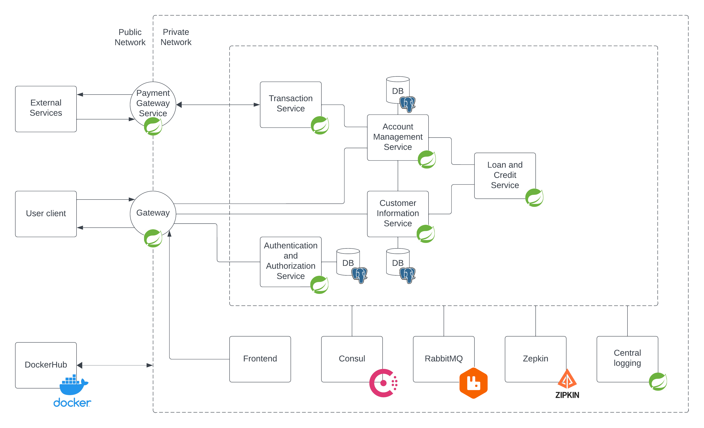
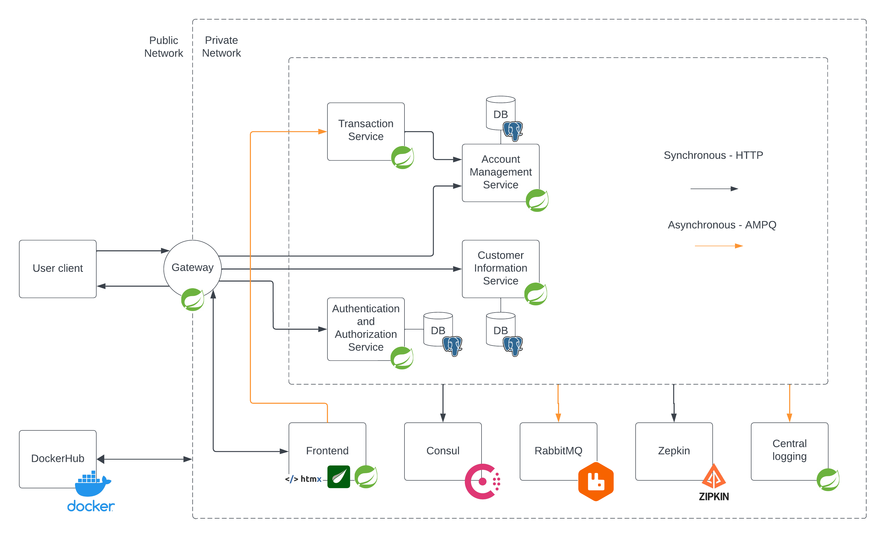

# PG3402_exam

OBS! This exam is done on a Windows machine, 
some of the commands might need change if it is run on a Mac / Linux computer!

### Table of Contents

1. [How to run Voops Bank](#how-to-run-voops-bank)
    - [Method 1: Download Everything from Dockerhub](#Methode-1-download-everything-from-dockerhub)
    - [Method 2: Compile all the services yourself](#methode-2-compile-all-the-services-yourself)
    - [Method 3: Hybrid mode between docker and intellij](#methode-3-hybrid-mode-between-docker-and-intellij)
2. [Goals from the Arbeidskrav](#goals-from-the-arbeidskrav)
    - [User stories](#user-stories)
    - [Simple System Design drawing](#simple-system-design-drawing)
3. [Final result for the Exam](#final-result-for-the-exam)
    - [User stories](#user-stories-1)
    - [Simple System Design drawing](#simple-system-design-drawing-1)
4. [Differences between Arbeidskrav and Exam](#differences-between-Arbeidskrav-and-Exam)
5. [Login information](#login-information)
6. [Design decision explained](#design-decision-explained)

<br>

### How to run Voops Bank
When using any of these methode listed under, here are som tips:
- Check consul service tab to everything is up ad running.
- In the docker-compose file I have 3 instance of most services to show it is load balanced.
This can be taxing on the computer, remember to take it down to one if needed!!!
- Every non-infrastructure service have 10-second delay in startup for making sure
that every infrastructure service has booted up.
- There is 3 gateways, tha app works by picking any of them. 
- The page uses cookies, so you can close the tab and pick a new gateway, 
and it remembers your login

<br>

Between run, I recommend running this command! 
It removes every stored images and volumes stored in docker and will reset the app!
PS: IT DELETES EVERY IMAGE AND VOLUMES!
```shell
docker system prune -a --volumes
```

<br>

#### Methode 1: Download Everything from Dockerhub
This is docker compose file reference all the needed services from docker hub 
and works after running this single command:
```shell
docker-compose --file .\docker-compose-from-dockerhub.yml up
```
<br>

#### Methode 2: Compile all the services yourself
This is docker compose file reference all the infrastructure services from docker hub
and compiles all the services in intellij do docker images for docker compose to start.
Might take some time, but works after running this one command:
```shell
docker-compose up --build
```
<br>

#### Methode 3: Hybrid mode between docker and intellij
This is docker compose file reference all the needed services from docker hub
and required you to start all the services in IntelliJ yourself. 
The services don't need any configuration for this to work, but you need to 
start them yourself :-)
PS: this is a backup solution should both methode 1 and 2 fail!
1. Run this and make sure everything is running
```shell
docker-compose --file .\docker-compose-infrastructure.yml up
```
2. Start the services from IntelliJ

<br>

### Goals from the Arbeidskrav
#### User stories
- As a private customer, I want to sign in to my bank and see what my account value is.
- As a private customer, I want to make an account to this bank.
- As a private customer, I want to transfer money between my personal account and others.
- As a private customer, I want to pay my bills.
- As a private customer, I want to apply for loan and / or credit card.
- As a private customer, I want to apply for insurance (collaboration with college).
- As a private customer, I want to connect my account to a money transfer service
(collaboration with college).

#### Simple System Design drawing


<br>

### Final result for the Exam
#### User stories
- As a private customer, I want to make an account to this bank.
- As a private customer, I want to sign in to my bank and see what my account value is.
- As a private customer, I want to sign in to my bank and create a new account.
- As a private customer, I want to transfer money between my personal account.
- As a private customer, I want the browser to remember my login for a short period 
after signing in. After a while sign me out automatically.

#### Simple System Design drawing


<br>

### Differences between Arbeidskrav and Exam
The main difference between them are the reduced user stories.
While planning for the bank I looked for the basic stories that I considered 
as an MVP for a bank. While coding and explained mainly in the reflection document
I stumbled across many technical field that I wanted to do well instead of making
all features originally listed. So I landed on the very for what you can imagine
a bank should do; make account, login, view how much the accounts have and transfer 
between them. 

Sadly I never got to implement transfer between persons accounts, but I believe what 
I have delivered is a functional MVP where prioritizing getting as much testing and 
best practise have more value. 

<br>

### Login information
This is the login data for the very first generated account:
- username: id
- password: password

Every other account auto generated will show a random username and password that you 
need to save before logging in. If you make one yourself, just use what you wrote to
make it!

<br>

### Design decision explained
- When you make an account, there is frontend check on email. Everything else is 
checked for Blank and Null values at controller.
- When you log in there will be made a cookie that will time out by itself after
2 minutes. 
- Every account is made with 1000,- for giving you the chance of testing transferring
money. 
- The transfer is on purpose slowed down with sleep commando for simulating a conformation
of money transfer. This is also why the frontend talks asynchronous with the transfer service.
- There is one postgres for every service that need to store data, the reasoning for it
is that if a DB goes down, it should not "shut" every other service down. 
- Instead of sharing personId between, I make a personal ID that is shared between 
services for "GDPR safety".
- In docker every service starts in port 8080, but starts up with random port
to prove that the whole system can be scaled both up and down. Default behavior is 
most services starts with 3 instances. 
